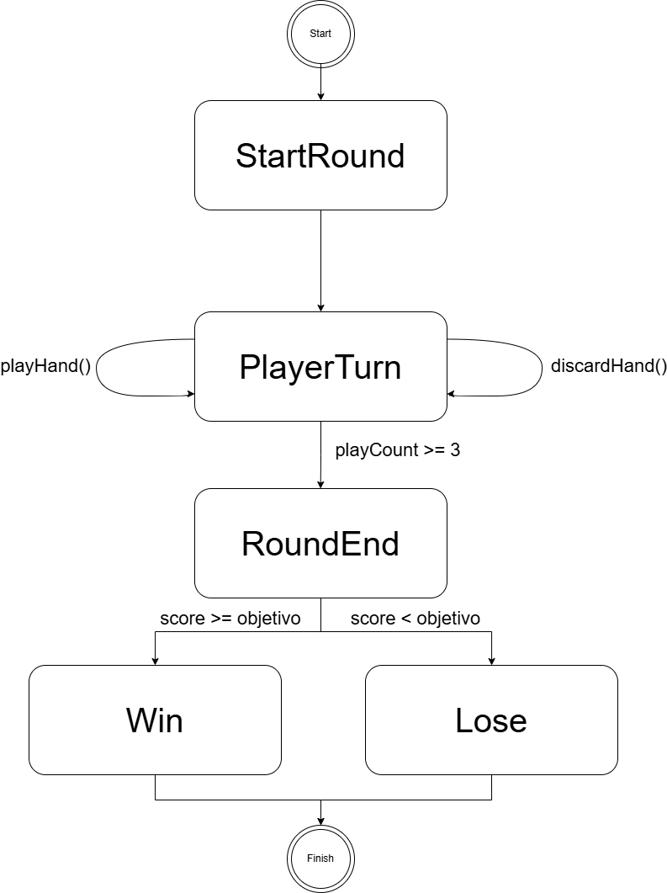

# Malatro
CC3002 - Metodologías de Diseño y Programación
Rodrigo Guerrero Rojas

El proyecto Malatro es un juego de cartas donde el jugador forma manos de póker usando una baraja estándar y diferentes tipos de Jokers para obtener el mayor puntaje posible antes de quedarse sin jugadas.

## Organización del código
```
src/main/scala/
├── rank/            # Rangos y clasificaciones
├── suit/            # Pintas de cartas
├── joker/            # Jokers activos
├── combinations/     # Combinaciones de poker
├── controller/       # Controlador y estados del juego
├── observer/         # Patron Observer
├── exceptions/       # Excepciones
├── Card.scala
├── Hand.scala
├── PokerHand.scala
├── PokerHelpers.scala
├── Score.scala
└── ScoreCalculator.scala

src/test/scala/
├── MalatroTest.scala
├── PokerCombinationTest.scala
├── HandTest.scala
├── HandExceptionTest.scala
├── ScoreTest.scala
├── ScoreCalculatorTest.scala
├── GameControllerTest.scala
└── TemplateConfigurationSmokeTest.scala
```
# Componentes del Juego
El proyecto modela cartas, rangos, pintas, Jokers, manos, combinaciones de poker, puntaje y controlador.
Una mano puede tener hasta 8 cartas y 2 Jokers activos. En cada ronda el jugador tiene hasta 3 jugadas y 3 descartes. Cada jugada o descarte debe usar entre 1 y 5 cartas.
El puntaje objetivo de la partida es 1000.

# Cálculo de Puntaje
ScoreCalculator calcula el puntaje completo de una jugada:
1. Detecta la mejor combinación de poker.
2. Usa el puntaje base de esa combinación.
3. Suma los chips de cada carta jugada una sola vez.
4. Aplica los efectos de los Jokers activos.
5. Retorna chips * multiplicador.

# Combinaciones
Las combinaciones se evalúan en orden de prioridad:
StraightFlush > Flush > Straight > ThreeOfAKind > Pair > HighCard

# Jokers implementados:
GreedyJoker: suma +3 al multiplicador por cada Diamante.
EvenSteven: suma +4 al multiplicador por cada rango par.
ScaryFace: suma +30 chips por cada figura.
DeviousJoker: suma +100 chips si hay Straight o StraightFlush.

# Controlador
El controlador usa el patron State para representar el flujo de la partida:
PreGame -> PlayerTurn -> RoundEnd

1. PreGame: Estado inicial.
2. PlayerTurn: Permite jugar y descartar cartas.
3. RoundEnd: Estado final cuando no quedan jugadas.

El controlador acumula el puntaje con totalScore, guarda el puntaje de la última jugada con lastPlayScore y entrega el resultado mediante resultMessage.
Si totalScore >= 1000, la partida se gana. En caso contrario, se pierde.

# Patrones de Diseño:
Se usan los siguientes patrones:
1. State: para modelar las fases de la partida.
2. Observer: Hand notifica al GameController cuando se acaban las jugadas.
3. Double dispatch: para aplicar los efectos de los Jokers sobre rangos, pintas y combinaciones.
4. Singleton: rangos, pintas y Jokers se modelan como object.

# Decisiones de Diseño
PokerHelpers concentra validaciones comunes para evitar duplicación entre combinaciones.
PokerHand decide la mejor combinación siguiendo el orden de prioridad.
ScoreCalculator está separado de Hand para que el cálculo de puntaje tenga una responsabilidad clara y sea fácil de testear.
Se usan excepciones personalizadas para acciones inválidas, como jugar demasiadas cartas, exceder los descartes o usar índices inválidos.


## Testing
Los tests cubren las entidades principales del modelo, incluyendo cartas, rangos, pintas, puntaje y Jokers. También se prueban las combinaciones de poker, su orden de prioridad, los casos especiales del As en escaleras, las operaciones de `Hand` y sus excepciones. Además, se agregan tests para `ScoreCalculator` y tests para el controlador, verificando las transiciones `PreGame`, `PlayerTurn` y `RoundEnd`, el descarte de cartas, el intento de jugar antes de iniciar la partida, y los casos de victoria o derrota según el puntaje objetivo de `1000`.

## Diagrama de estados



### Explicación

El diagrama representa el flujo principal de una partida. El juego comienza en `PreGame`, estado en el que la partida todavía no ha iniciado. Al ejecutar `startGame`, el controlador cambia a `PlayerTurn`, que es el estado donde el jugador puede realizar sus acciones principales.
Desde `PlayerTurn`, el jugador puede ejecutar `playHand` para jugar un conjunto de cartas o `discardHand` para descartar cartas. Ambas acciones deben respetar las reglas del juego: se debe seleccionar al menos 1 carta y como máximo 5 cartas. Además, la mano permite hasta 3 jugadas y hasta 3 descartes.
Mientras el jugador aún tenga jugadas disponibles, el flujo se mantiene en `PlayerTurn`. Cuando se utiliza la última jugada disponible, `Hand` notifica al `GameController` mediante el patron Observer, y el controlador pasa a `RoundEnd`.
En `RoundEnd`, la partida ya termino. Si el puntaje acumulado (`totalScore`) es mayor o igual al puntaje objetivo (`targetScore`, por defecto 1000), el resultado es victoria. Si no se alcanza ese puntaje, el resultado es derrota. Este resultado se puede consultar mediante `resultMessage`.